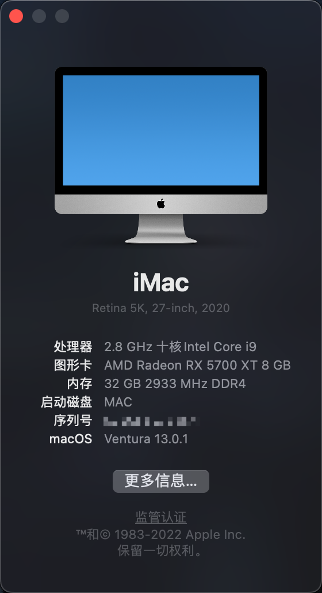
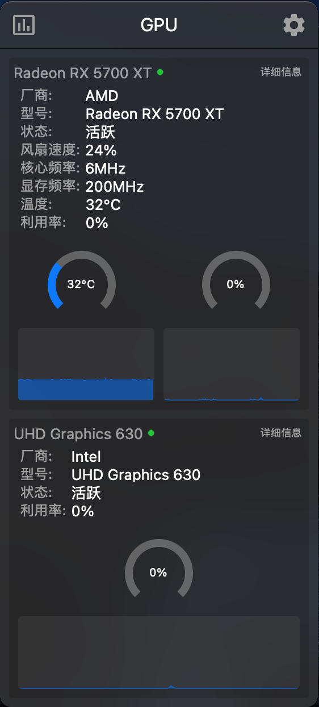
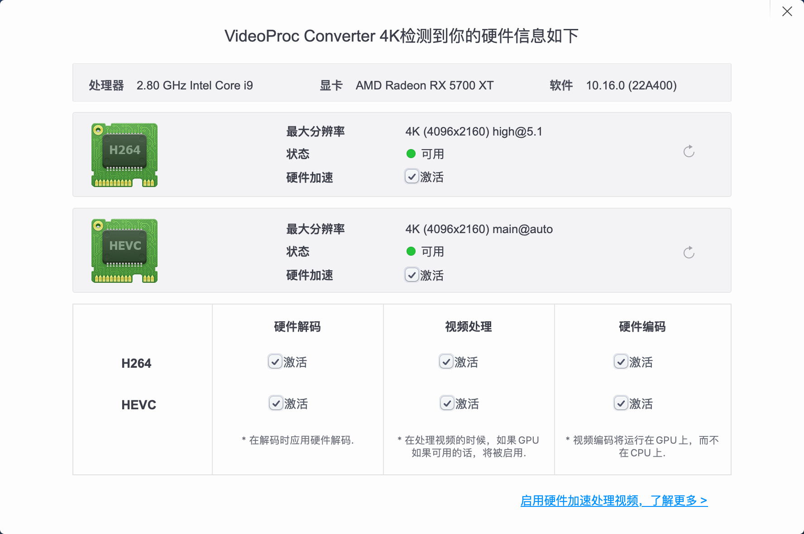

# B460i_Hackintosh

基于华硕 [ROG STRIX B460-I GAMING](https://rog.asus.com.cn/motherboards/rog-strix/rog-strix-b460-i-gaming-model/) 主板的 **Open Core** 黑苹果引导

> OpenCore：0.8.8  
>
> macOS：Ventura 13.0.1

|  |  |
| ------------------ | ------------------ |

参考文档：

[Dortania's OpenCore Install Guide](https://dortania.github.io/OpenCore-Install-Guide/)

[Xjn´s Blog ：使用 OpenCore 引导黑苹果](https://blog.xjn819.com/post/opencore-guide.html)

[OpenCore bootloader](https://github.com/acidanthera/OpenCorePkg)

[OpenCore 简体中文参考手册](https://oc.skk.moe/)

## 实现的功能

*  Wi-Fi&蓝牙工作正常
*  核显已驱动
*  隔空投送工作正常
*  随航工作正常
*  USB已定制，速率5G
*  睡眠唤醒正常

## 工具

[OpenCore Auxiliary Tools (OCAT)](https://github.com/ic005k/OCAuxiliaryTools)

[Hackintool](https://github.com/headkaze/Hackintool)

## 使用
- 将EFI文件夹放入ESP分区
- 需要使用[OpenCore Auxiliary Tools (OCAT)](https://github.com/ic005k/OCAuxiliaryTools)或其他工具生成`EFI/OC/config.plist`中的`SystemProductName`,`SystemSerialNumber`,`SystemUUID`字段

## BIOS设置

|      Setting       |  Value  |
| :----------------: | :-----: |
|     Fast Boot      | Disable |
|    Secure Boot     | Disable |
|        VT-d        | Disable |
|        CSM         | Disable |
|     Intel SGX      | Disable |
|        VT-x        | Enable  |
| Above 4G decoding  | Enable  |
|  Hyper-Threading   | Enable  |
|   XHCI Hand-off    | Enable  |
| DVMT Pre-Allocated |  64MB   |
|     SATA Mode      |  AHCI   |
| iGPU Multi-Monitor | Enable  |
|    Erp Support     | Disable |

## 硬件
* 主板：[ROG STRIX B460-I GAMING](https://www.asus.com.cn/Motherboards/ROG-STRIX-B460-I-GAMING/)
* CPU：[Intel® Core™ i9-10900](https://www.intel.cn/content/www/cn/zh/products/sku/199328/intel-core-i910900-processor-20m-cache-up-to-5-20-ghz/specifications.html)
* 显卡：[AMD Radeon RX 5700 XT 公版](https://www.amd.com/zh-hans/products/graphics/amd-radeon-rx-5700-xt) 
* 网卡：[BCM94352Z（fenvi）](https://cn.fenvi.com/product_detail_39.html)
* 内存：[芝奇 Ripjaws V 3200MHz 16Gx2](https://gskill.com/cn/product/204/218/1535687484/F4-3200C16S-16GVK)  
* 硬盘：[西数 WD_BLACK™ SN750 500G](https://shop.westerndigital.com/zh-cn/products/internal-drives/wd-black-sn750-nvme-ssd#WDS500G3X0C) 
